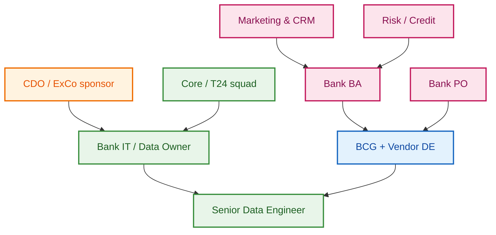
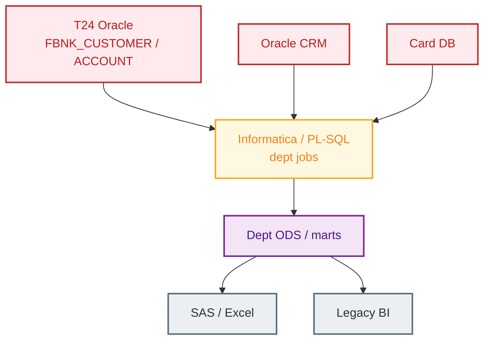
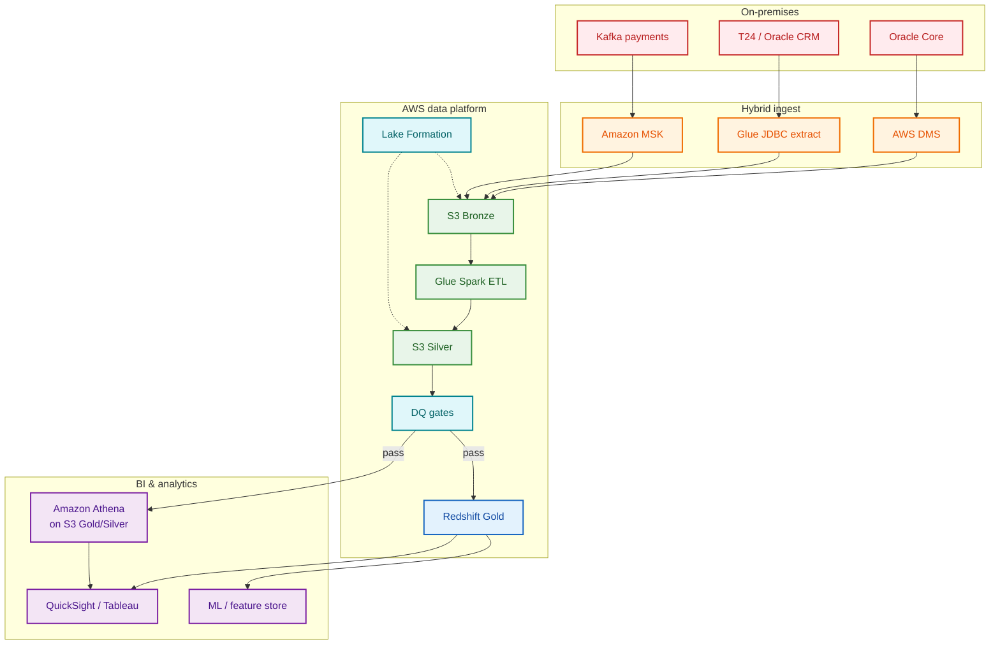
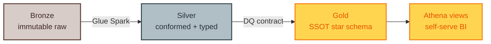
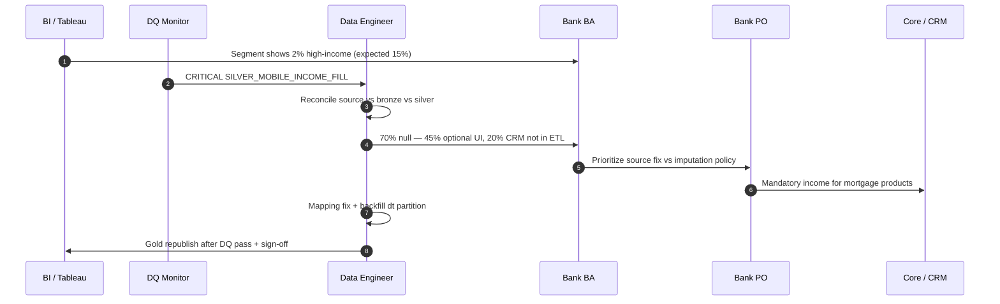

# BCG VN Digital Bank Transform — AWS Data Platform

**Data Solution portfolio** for consulting-led **Digital Bank Transformation** programs at Vietnamese retail banks (**MSB**, **Techcombank / TCB**). Covers migration of **on-prem Oracle** and **Temenos T24** data domains to an **AWS** data stack: medallion lakehouse, **Glue/Spark ETL**, **Redshift** gold marts, **Amazon Athena** BI layer, and governed **Customer SSOT**.

| Meta | Value |
|------|-------|
| **Engagement** | BCG-style strategy + delivery SI |
| **Domain** | Retail banking (BFSI), NHNN-regulated |
| **Sources** | Oracle RAC (core/CRM), **T24** `FBNK_*`, card, Kafka payments |
| **Cloud** | S3, Glue, Lake Formation, MSK, Redshift, **Athena**, Step Functions / Airflow |
| **JD alignment** | [KUP Partner Senior Data Engineer](interview/03-jd-kup-partner-mapping.md) — hybrid ETL, SSOT, DQ, governance |

> **Disclaimer:** Anonymized **educational case study** for portfolio and interview use. No confidential bank data, proprietary BCG deliverables, or production credentials.

---

## Table of contents

1. [Business — context & pain points](#1-business--context--pain-points)
2. [Architecture — as-is vs proposed](#2-architecture--as-is-vs-proposed)
3. [Engagement snapshots (MSB & TCB)](#3-engagement-snapshots-msb--tcb)
4. [Sample engineering code — as-is vs proposed](#4-sample-engineering-code--as-is-vs-proposed)
5. [Real-world ETL & production issues](#5-real-world-etl--production-issues)
6. [Vendor ↔ bank collaboration (BA, PO, IT)](#6-vendor--bank-collaboration-ba-po-it)
7. [JD mapping & interview pitch](#7-jd-mapping--interview-pitch)
8. [Consulting DE — technical fit & client communication](#8-consulting-de--technical-fit--client-communication)
9. [Repo map](#9-repo-map)

---

## 1. Business — context & pain points

### 1.1 Current state (typical VN retail bank)

| Dimension | As-is reality |
|-----------|---------------|
| **Core** | Temenos **T24** / Flexcube on **Oracle** RAC — system of record |
| **Channels** | Mobile, internet banking, branch, CRM, card switch |
| **Analytics** | Department ODS silos; Excel; legacy **Informatica / PL-SQL** |
| **Cloud** | File dumps to S3; no enterprise **SSOT** or DQ contracts |
| **Customer** | Same person = multiple IDs (CIF, CRM `party_id`, app `user_id`) |
| **Regulatory** | NHNN reporting, AML/KYC, PDPA — audit asks for **lineage** |

### 1.2 Pain points (why Digital Bank Transform + AWS)

| Pain | Business impact | Engineering symptom |
|------|-----------------|---------------------|
| **No single customer view** | Cross-sell fails; duplicate outreach | 3–5 ID variants; ad hoc merge |
| **Missing / optional attributes** | Credit & marketing blind spots | e.g. **~70% missing income** on onboarding |
| **Batch-only T+1** | Campaigns miss window; fraud lag | 18–36h pipeline; no intraday |
| **Oracle capacity ceiling** | Cannot scale digital analytics | Extract clashes with EOD / T24 COB |
| **Opaque ETL** | Audit findings | Undocumented mappings; tribal knowledge |
| **Digital parallel run** | Dual maintenance | Cannot export **prod T24** to vendor cloud |
| **DQ after the fact** | Wrong dashboards in prod | BI finds null spikes **after** publish |

**Executive one-liner:**

> *We cannot run digital banking analytics on 20-year-old batch silos — we need a governed cloud landing zone, customer SSOT, and quality gates before gold hits risk and marketing.*

Detail: [`docs/01-business-context.md`](docs/01-business-context.md)

### 1.3 Stakeholder landscape



---

## 2. Architecture — as-is vs proposed

### 2.1 As-is (on-prem silos)



**Problems:** point-to-point extracts, no bronze layer, PII scattered, **NVL(NULL,0)** income bugs, no hybrid ingest contract.

Full doc: [`docs/02-as-is-architecture.md`](docs/02-as-is-architecture.md)

### 2.2 Proposed — hybrid lakehouse + BI (AWS)



### 2.3 Medallion data flow



| Principle | Implementation |
|-----------|----------------|
| **Medallion** | Bronze → Silver → Gold (Redshift) + Athena views |
| **Hybrid** | Oracle/T24 = SoR; cloud = **analytics SSOT** |
| **Customer SSOT** | `dim_customer` SCD2 + `xref_customer_id` |
| **DQ shift-left** | Block gold on CRITICAL breach |
| **Lineage** | `pipeline_run_id` on every row |
| **Imputation** | `declared_*` vs `estimated_*` — never silent overwrite |

Full doc: [`docs/03-to-be-architecture.md`](docs/03-to-be-architecture.md) · [`docs/04-as-is-to-be-summary.md`](docs/04-as-is-to-be-summary.md)

---

## 3. Engagement snapshots (MSB & TCB)

| | **MSB — marketing AWS pilot** | **TCB — digital / streaming layer** |
|---|-------------------------------|----------------------------------------|
| **Trigger** | Cloud-first marketing analytics | Digital core build; **no prod T24 export** |
| **Scope** | Marketing datasets, dashboards | Synthetic core + **~1–2M payment checks/day** |
| **AWS** | Glue, S3, Redshift-style marts, **Athena** | MSK → bronze → silver reconciliation |
| **Outcome** | Prod pilot; pattern before big-bang | ~90% data pilot; parallel legacy vs digital |
| **Story angle** | Domain pilot de-risks enterprise migration | Regulatory constraint → synthetic + streaming |

Deep dives: [`cases/msb-marketing-aws-pilot.md`](cases/msb-marketing-aws-pilot.md) · [`cases/tcb-digital-streaming-layer.md`](cases/tcb-digital-streaming-layer.md)

---

## 4. Sample engineering code — as-is vs proposed

### 4.1 Side-by-side

| Layer | **As-is (on-prem)** | **Proposed (AWS)** |
|-------|---------------------|---------------------|
| Extract | Ad hoc SQL, no watermark | [`oracle_extract_customer.sql`](samples/oracle_extract_customer.sql), [`t24_account_extract.sql`](samples/t24_account_extract.sql) |
| Transform | [`legacy_ods_plsql.sql`](samples/legacy_ods_plsql.sql) — NVL bugs, no lineage | [`glue_customer_bronze_to_silver.py`](samples/glue_customer_bronze_to_silver.py) |
| Warehouse | Dept ODS merge | [`dim_customer_scd2.sql`](samples/dim_customer_scd2.sql) |
| Orchestration | Cron / manual | [`airflow_hybrid_etl_dag.py`](samples/airflow_hybrid_etl_dag.py) |
| Streaming | N/A | [`kafka_payment_landing.py`](samples/kafka_payment_landing.py) |
| DQ | After BI finds issue | [`dq_contract.py`](samples/dq_contract.py), [`dq_income_completeness.sql`](samples/dq_income_completeness.sql) |
| BI | Direct ODS query | [`athena_customer_360.sql`](samples/athena_customer_360.sql) |

### 4.2 As-is vs proposed — income handling

**As-is (anti-pattern):**

```sql
-- legacy_ods_plsql.sql — NULL becomes 0
NVL(crm.annual_income, 0) AS income
```

**Proposed (governed):**

```python
# glue_customer_bronze_to_silver.py — preserve NULL; quarantine invalid
income = bronze_row.get("declared_income_amount")
if income is not None and float(income) < 0:
    return None  # quarantine
```

```sql
-- dim_customer_scd2.sql — separate declared vs estimated
declared_income_amount,
estimated_income_amount,
is_imputed
```

### 4.3 Quick run (local)

```bash
cd samples
python dq_contract.py
python glue_customer_bronze_to_silver.py   # DRY_RUN=1, no Spark cluster
```

---

## 5. Real-world ETL & production issues

Consolidated playbook: [`docs/05-real-world-issues.md`](docs/05-real-world-issues.md)

| Category | Example | Process fix | Technical fix |
|----------|---------|-------------|---------------|
| **Missing customer fields** | ~70% null income | BA segment analysis; PO policy on mandatory fields | Separate `estimated_*`; DQ block gold |
| **Data quality** | NULL→0 in legacy ETL | Data contract with business owner | Remove NVL; quarantine invalid |
| **Data governance** | Imputed income in credit | Compliance sign-off matrix | Lake Formation deny; column split |
| **Source input missing** | CRM view delayed | PO escalates RAID; MVP scope cut | Partial silver with `source_system` flag |
| **Source–target mapping** | CRM income not in gold | BA updates mapping spec vX.Y | Fix join; backfill partition |
| **Hybrid Oracle↔AWS** | VPN blip, half file | Comms to BI before refresh | `_SUCCESS` marker; no downstream trigger |
| **Production** | Glue OOM, partial partition | Incident template + postmortem | Staging path + atomic commit |
| **BI layer** | Wrong FX / duplicate grain | Glossary owned by BA | Gold reconciliation vs finance control |

**Flagship case:** optional income → measure → source fix → flagged imputation → policy by use case.  
[`docs/06-case-missing-customer-income.md`](docs/06-case-missing-customer-income.md)

### 5.1 Incident flow (missing fields detected in prod)



---

## 6. Vendor ↔ bank collaboration (BA, PO, IT)

| Topic | Document |
|-------|----------|
| RACI, ceremonies, escalation | [`docs/07-vendor-bank-collaboration.md`](docs/07-vendor-bank-collaboration.md) |
| Source → target mapping | [`docs/08-source-target-mapping.md`](docs/08-source-target-mapping.md) |

**Key roles in production issues:**

| Role | Typical responsibility |
|------|------------------------|
| **Bank BA** | Metric definition, mapping spec, UAT samples, segment analysis |
| **Bank PO** | Prioritization, go/no-go gold publish, RAID escalation |
| **Bank IT / DE** | Prod ops, extract windows, runbooks, IAM |
| **Core squad** | T24 COB calendar, CIF truth, DB grants |
| **Vendor DE** | Glue jobs, DQ implementation, incident fix |
| **Risk / Compliance** | Allowed use of estimated attributes |

---

## 7. JD mapping & interview pitch

### 7.1 KUP Partner Senior Data Engineer ↔ this repo

| JD requirement | Evidence |
|----------------|----------|
| Hybrid Oracle + AWS ETL | `oracle_extract_*.sql`, `t24_account_extract.sql`, `airflow_hybrid_etl_dag.py` |
| S3, Glue, Lake Formation, Redshift, **Athena** | Architecture docs + `athena_customer_360.sql` |
| SSOT / customer BFSI | `dim_customer_scd2.sql`, case docs |
| DQ, lineage, governance | `dq_contract.py`, docs 05–08 |
| Spark, Airflow, Python, SQL | All `samples/` |
| Client / mentorship | `cases/*.md`, `07-vendor-bank-collaboration.md` |

Full mapping: [`interview/03-jd-kup-partner-mapping.md`](interview/03-jd-kup-partner-mapping.md)

### 7.2 90-second pitch (English)

```text
I'm a senior data engineer with about six years in Vietnamese retail banking,
mostly on consulting programs moving analytics from Oracle and T24 silos to AWS.

At MSB I helped deliver a cloud-first marketing pilot — Glue ETL into modeled
marts and Athena views so marketing could query AWS without waiting for enterprise big-bang.

At Techcombank the constraint was harder: production core data couldn't leave
the bank, so we built a synthetic staging layer and Kafka streaming for about
one to two million daily payment checks into cloud bronze, then conformed silver
for digital banking parallel run.

I'm strongest on customer domain quality — like optional income fields with
seventy percent missing — where we combine source remediation, DQ gates, and
clearly separated declared versus estimated attributes in the warehouse.

That's the same shape as your Data Enhancement program: hybrid ingest, SSOT,
and governed pipelines on Glue, Redshift, and Athena.
```

Interview pack: [`interview/01-cto-round-prep.md`](interview/01-cto-round-prep.md) · [`interview/02-practice-questions.md`](interview/02-practice-questions.md)

---

## 8. Consulting DE — technical fit & client communication

Prep for **consulting-level delivery** (not chỉ execution): technical credibility + proactive client relationship.

| Theme | What to communicate | Detail |
|-------|----------------------|--------|
| **Technical** | Kỹ năng phù hợp scope hybrid Oracle/T24 → AWS, SSOT, DQ, streaming | Repo samples + MSB/TCB cases |
| **Client relationship** | Chủ động, nhanh nhạy, độc lập hơn với BA/PO; báo risk sớm; đưa options + recommendation | Scripts VN/EN, 30-day plan |

**Key messages (summary):**

- **Technical:** Anh Tú có kinh nghiệm kỹ thuật tốt, phù hợp scope dự án (hybrid ETL, customer domain, governance trên AWS).
- **Communication:** Khách consulting cần mức deliver tư vấn — acknowledge feedback, cam kết chủ động align BA/PO, frame business impact, close loop đến khi stakeholder hài lòng.

Full talking points, scripts, and diagrams: [`interview/05-consulting-de-client-communication.md`](interview/05-consulting-de-client-communication.md)  
**Print 1-page cheat sheet:** [`interview/06-consulting-de-cheat-sheet-1page.md`](interview/06-consulting-de-cheat-sheet-1page.md)

---

## 9. Repo map

```
bcg-vn-digital-bank-data-platform/
├── README.md
├── docs/
│   ├── 01-business-context.md
│   ├── 02-as-is-architecture.md
│   ├── 03-to-be-architecture.md
│   ├── 04-as-is-to-be-summary.md
│   ├── 05-real-world-issues.md
│   ├── 06-case-missing-customer-income.md
│   ├── 07-vendor-bank-collaboration.md      ← BA / PO / vendor process
│   └── 08-source-target-mapping.md          ← mapping & change control
├── cases/
│   ├── msb-marketing-aws-pilot.md
│   └── tcb-digital-streaming-layer.md
├── samples/                                   ← as-is + proposed code
├── interview/                                 ← JD, CTO prep, consulting communication
│   └── 05-consulting-de-client-communication.md
└── requirements.txt
```

---

## Author

**Will Tran** — Data engineering, VN retail banking, AWS hybrid migrations.

**License:** MIT (educational use). Patterns are composite and anonymized.
