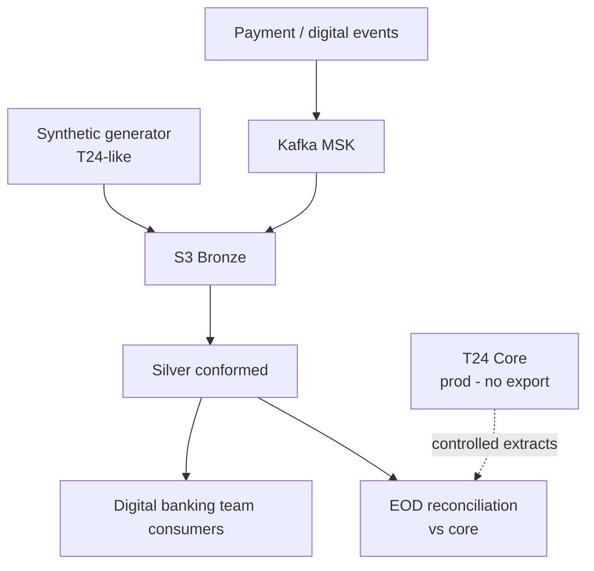

# Case: Techcombank — Digital banking data layer (synthetic + streaming)

> Anonymized pattern from **digital banking migration** with T24 constraints and high-volume payment validation.

---

## 1. Context

| Item | Detail |
|------|--------|
| Client | Techcombank (TCB) — leading VN digital retail bank |
| Trigger | New digital core / channel; legacy T24 parallel run |
| Constraint | **Production T24 data cannot** be exported to vendor/cloud as-is |
| Pressure | High digital transaction volume; aggressive release cadence |

---

## 2. Business problem

| Pain | Detail |
|------|--------|
| Integration testing unrealistic | Vendors need **volume + shape** without prod PII |
| Batch too slow | Payment checks need **near-real-time** path to cloud staging |
| Mapping complexity | T24 data model niche; few engineers understand mappings |
| Program scale | Digital banking + data pilot ~90% success → contract extension |

---

## 3. Solution pillars

### 3.1 Synthetic / staging layer

- Build **T24-like** synthetic feed for non-prod and controlled paths  
- Generated customers, accounts, transactions with realistic distributions  
- Enables vendor + bank joint testing **without** prod export breach

### 3.2 Streaming payment checks

```text
Payment switch / digital channel
    → Kafka (MSK)
    → Stream processor / Glue streaming
    → S3 bronze (checks)
    → Silver conformed
    → Reconcile daily with core totals
```

**Volume signal:** ~**1–2 million checks per day** through intermediate layer (interview figure).

### 3.3 Migration framework (Arrow)

- EU team **Arrow** migration framework adapted for Vietnam  
- Custom mappings T24 → newF → new digital layer  
- Vietnam squad extended framework for local entities  

---

## 4. Architecture diagram



---

## 5. Technical challenges

| Challenge | Response |
|-----------|----------|
| Mapping drift | Versioned mapping tables; joint sign-off workshops |
| Stream lag | Auto-scale consumers; DLQ for poison messages |
| Duplicate events | Idempotent `check_id` merge in silver |
| Parallel run | Flag `source_system` legacy vs digital in facts |
| Team split | VN data squad + EU framework team — clear RACI |

---

## 6. Outcomes

| Outcome | Detail |
|---------|--------|
| Data pilot ~90% | Digital team trusts staging layer for migration tooling |
| Contract extension | Consulting engagement expanded for wider core program |
| Pattern reuse | Bank sees **pack-by-pack** data migration vs big-bang |
| Legacy coexistence | Settlement on T24 while digital channel scales |

---

## 7. Lessons for hybrid Oracle + AWS JD

1. **Streaming + batch coexist** — JD mentions Kinesis/MSK; payment checks are the story.  
2. **Synthetic data is architecture** — not just test fixture when prod export forbidden.  
3. **Reconciliation is non-negotiable** — stream counts must tie to core EOD.  
4. **Senior DE role** — customize frameworks, not only write Glue scripts.

---

## 8. Interview STAR

| | |
|-|-|
| **S** | TCB digital program; cannot use prod T24 in cloud vendor env |
| **T** | Staging data layer + streaming checks at production-like volume |
| **A** | Synthetic feeds, Kafka pipeline, mapping workshops, Arrow customization |
| **R** | Pilot success; extended engagement; parallel legacy/digital run |

---

## 9. Talking points vs MSB

| MSB pilot | TCB |
|-----------|-----|
| Batch marketing | **Streaming** payments |
| Cloud appetite | **Regulatory constraint** |
| Smaller domain | **Core-adjacent** complexity |
| Prove AWS | Prove **migration path** |

Use **both** in interview to show range: batch lakehouse + event streaming.
