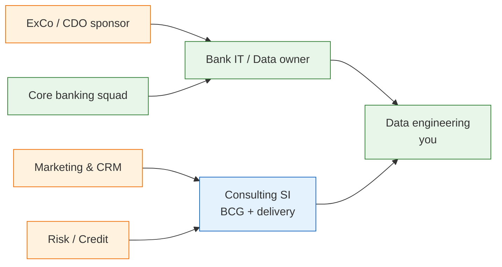

# Business context — VN retail bank data modernization

> **Disclaimer:** Composite narrative from typical consulting-led programs (BCG-style) at MSB, Techcombank, and peer VN banks. Not official bank documentation.

---

## 1. Market & strategic drivers

| Driver | Why it matters now |
|--------|-------------------|
| Digital banking race | TCB, VPBank, MB, etc. — mobile-first acquisition |
| NHNN / Basel expectations | Better risk aggregation, explainable customer data |
| Cost of on-prem Oracle | Extract windows + license vs elastic AWS analytics |
| Personalization & CRM | Need **customer 360** beyond core CIF |
| Fintech partnership | API + event streams into cloud |

---

## 2. Stakeholder map



---

## 3. As-is operating model

| Function | Typical behavior | Pain |
|----------|------------------|------|
| **Marketing** | Campaign lists from CRM export + Excel merge | Stale; duplicate customers |
| **Risk** | Overnight Oracle mart | Cannot see same-day digital onboarding |
| **Branch** | Optional fields on forms (income, occupation) | **High null rate** downstream |
| **IT** | Change board 4–6 weeks | 1 column | Backlog |
| **Audit** | Sample 50 rows in Excel | No lineage to source |

---

## 4. Pain point deep dive

### 4.1 Customer data fragmentation

- Core **CIF** ≠ CRM `party_id` ≠ digital app `user_id`
- Name variants (Unicode, missing diacritics), shared phone numbers (family)
- **Income** captured in CRM but not synced to warehouse column used by BI

### 4.2 Data quality is discovered late

```
Source (optional field) → ETL (null mapping) → ODS (accepted) → Tableau (wrong segment)
                                      ↑
                            No gate at silver layer
```

### 4.3 Hybrid friction

- Bulk extract only **02:00–05:00 VN** when core batch allows
- VPN / Direct Connect instability → partial files
- AWS team and Oracle DBA **different escalation paths**

### 4.4 Digital migration (TCB pattern)

- Cannot copy production T24 to vendor cloud
- Need **synthetic data** + **real payment volume** in non-prod paths
- Parallel run: legacy settlement vs digital core for months/years

---

## 5. Business outcomes (proposed program)

| KPI (examples) | Target direction |
|------------------|------------------|
| Customer SSOT match rate | 95%+ golden `customer_id` |
| Income completeness (retail onboarding, 7-day) | 85%+ declared or verified |
| Pipeline SLA (gold refresh) | 06:00 VN daily, <2% late days |
| DQ critical incidents / month | Trend down after shift-left |
| Time-to-insight for marketing | Hours not weeks |

---

## 6. Consulting engagement shape

| Phase | Duration | Deliverables |
|-------|----------|--------------|
| Discovery | 2–4 weeks | Source inventory, pain quantification, target architecture |
| Pilot (MSB-style) | 8–12 weeks | One domain live on AWS (e.g. marketing) |
| Scale | 6–18 months | SSOT, more domains, decommission legacy marts |
| Run | BAU | Hypercare → bank team or extended SI |

---

## 7. Questions to ask client (discovery)

1. Who is **system-of-record** for customer income — core, CRM, or onboarding app?
2. Is cloud analytics **read-only** from core or any write-back?
3. Regulatory use of **estimated** attributes — allowed for credit or not?
4. Existing **Informatica/Glue** — replace or wrap?
5. Success at **90 days** — one number the CDO cares about?
