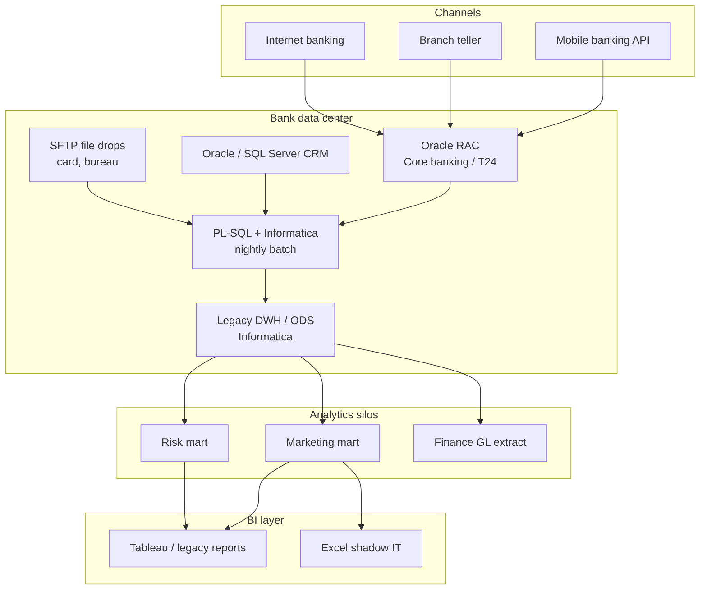

# As-is architecture — VN retail bank (pre-cloud program)

> Hypothesis consolidated from MSB/TCB-era programs and peer banks. Validate in discovery.

---

## 1. Landscape overview



**One sentence:** Batch ETL from Oracle into **department marts** with **no shared bronze** and **weak customer crosswalk**.

---

## 2. Component map

| Layer | Component | Role | Typical issue |
|-------|-----------|------|---------------|
| Source | T24 Oracle | Ledger, CIF, accounts | Long change cycles |
| Source | CRM | Leads, campaigns, optional KYC | **Income optional** |
| Source | Digital onboarding DB | eKYC, app profile | Not in nightly extract |
| Ingest | Informatica | Scheduled workflows | Undocumented mappings |
| Store | ODS tables | Dept-specific | Duplicate grain |
| Consume | SAS / SQL / Tableau | Reports | Metric definitions differ |

---

## 3. Data journey — customer income (as-is)

```text
Branch / App form (income OPTIONAL)
    → CRM API (may skip field)
    → Nightly Informatica (NULL → 0 or NULL inconsistent)
    → ODS CUSTOMER_DLY (column INCOME_AMT)
    → Marketing mart (filter income > 0 → only ~30% remain)
    → Tableau dashboard "Affluent segment" UNDERCOUNT
```

**No DQ gate.** BI team member count drop weeks later.

---

## 4. Non-functional as-is

| NFR | As-is |
|-----|-------|
| Availability | Batch T+1; failures fixed next morning |
| RPO/RTO | Replay from Oracle snapshot; hours |
| Security | DB roles; ad hoc PII in shared drives |
| Lineage | Excel mapping sheets |
| Cost | Oracle CPU pegged during extract window |

---

## 5. Gaps (why migrate)

| Gap | Risk |
|-----|------|
| No medallion / lake | Cannot reprocess history cheaply |
| No SSOT customer | Wrong campaign / wrong risk segment |
| No cloud scale | Digital events exceed batch window |
| No Lake Formation | PII sprawl when pilot S3 buckets appear |
| Informatica bottleneck | Skills scarce; slow to change |

---

## 6. MSB as-is (marketing slice)

Before pilot:

- Marketing relied on **on-prem** partial copies + manual Excel from agency
- No self-serve cloud query; IT ticket for each extract
- **Pain:** campaign launch blocked on IT backlog

---

## 7. TCB as-is (digital slice)

Before synthetic/streaming layer:

- Digital team needed **near-real-time** payment validation
- Prod T24 **cannot** feed vendor environment
- **Pain:** integration testing on unrealistic volumes; go-live risk

See to-be: [`03-to-be-architecture.md`](03-to-be-architecture.md)
