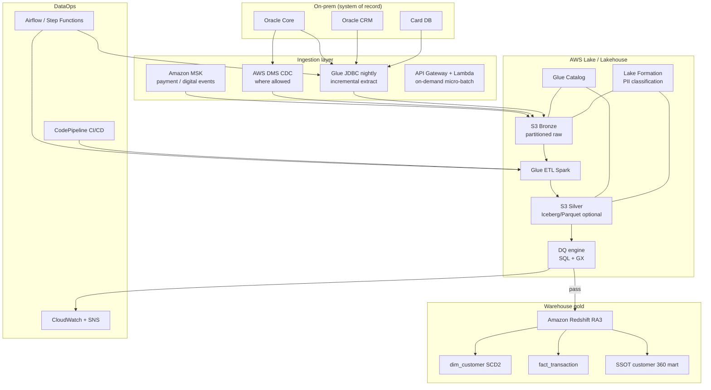

# To-be architecture — hybrid AWS lakehouse + SSOT

Target state for **Data Enhancement** program (KUP Partner JD aligned).

---

## 1. Target landscape



---

## 2. Medallion tiering

| Tier | S3 path pattern | Content | Retention |
|------|-----------------|---------|-----------|
| **Bronze** | `s3://bank-lake/bronze/{system}/{entity}/dt=YYYY-MM-DD/` | Immutable raw; audit cols | 7+ years (policy) |
| **Silver** | `.../silver/{domain}/{entity}/` | Typed, deduped, `customer_id` conformed | 5 years |
| **Gold** | Redshift `gold.*` | Star schema, SSOT marts | Current + history SCD |

**Standard audit columns:** `ingest_ts`, `source_system`, `source_file`, `pipeline_run_id`, `record_hash`

---

## 3. Customer SSOT model

```mermaid
erDiagram
    DIM_CUSTOMER ||--o{ XREF_CUSTOMER_ID : maps
    DIM_CUSTOMER ||--o{ FACT_CUSTOMER_SNAPSHOT : monthly
    DIM_ACCOUNT }o--|| DIM_CUSTOMER : belongs

    DIM_CUSTOMER {
        bigint customer_sk PK
        string customer_id NK
        date valid_from
        date valid_to
        boolean is_current
        decimal declared_income_amount
        string declared_income_currency
        decimal estimated_income_amount
        boolean is_imputed
        string income_confidence
    }

    XREF_CUSTOMER_ID {
        string golden_customer_id
        string source_system
        string source_customer_id
    }
```

**Rule:** Never overwrite `declared_*` with ML/bureau fills — use `estimated_*` + flags.

---

## 4. Hybrid Oracle extract pattern

| Pattern | When | Tool |
|---------|------|------|
| Full snapshot (small ref) | Monthly | Glue JDBC + S3 overwrite |
| Incremental `last_update_ts` | CRM, customer delta | Watermarked extract |
| CDC | Low-latency account if approved | DMS → S3 |
| Event | Payments, digital | MSK → bronze stream |

**VN timezone:** All business dates in **`Asia/Ho_Chi_Minh`**; store UTC in `ingest_ts`.

---

## 5. DQ shift-left

```text
Bronze ──► schema contract
Silver ──► completeness, uniqueness, referential
Gold   ──► business rules (mortgage must have income band)
         ──► BLOCK publish if severity=CRITICAL
```

Critical rules (examples):

- `customer_id` not null in silver customer
- Duplicate national_id above threshold → quarantine
- Income completeness by product below SLA → alert + optional block

---

## 6. Security & governance

| Control | Service |
|---------|---------|
| Encryption at rest | SSE-KMS on S3, Redshift |
| Column-level PII | Lake Formation tags `PII`, `FINANCIAL` |
| Network | VPC endpoints; no public S3 |
| IAM | Separate roles: `glue-etl-prod`, `redshift-read-bi` |
| IaC | Terraform / CloudFormation per environment |

---

## 7. BI & consumption

| Consumer | Pattern |
|----------|---------|
| Tableau / QuickSight | Redshift `gold` views only — no bronze |
| Data science | SageMaker features from silver/gold |
| Regulatory | Controlled export role; immutable audit log |
| Reverse ETL | Optional — CRM update **only** with compliance sign-off |

---

## 8. MSB to-be (marketing pilot scope)

- Marketing datasets in **gold.mkt_*** without waiting for enterprise SSOT
- Reusable Glue job templates + catalog
- Self-serve QuickSight/Tableau on Redshift role

---

## 9. TCB to-be (digital scope)

- **Synthetic T24-like** feed → bronze (non-prod contract)
- **Kafka** payment checks → bronze → silver reconciliation with core daily totals
- Parallel run — Arrow framework customized for VN mappings

---

## 10. Migration roadmap (phased)

| Phase | Focus |
|-------|-------|
| 0 | Landing zone, IAM, LF, CI/CD skeleton |
| 1 | Customer bronze/silver + SSOT dim |
| 2 | Payments streaming + fact_transaction |
| 3 | Decommission dept ODS marts one-by-one |
| 4 | Real-time features for fraud/digital |

Summary table: [`04-as-is-to-be-summary.md`](04-as-is-to-be-summary.md)
