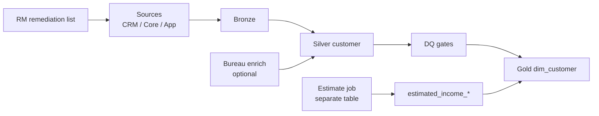

# Case study: missing customer income (~70% null)

Interview case from SotaTek HR screen + KUP JD customer data theme.

---

## 1. Problem statement

Retail bank captures **customer income** during onboarding / KYC. Field is **optional** in branch and digital forms.

| Metric | Value (example) |
|--------|-----------------|
| Total active retail customers | 2,000,000 |
| With non-null `declared_income` in gold | ~600,000 (**30%**) |
| Missing | ~1,400,000 (**70%**) |

**Consumers affected:** marketing segmentation, pre-approval offers, regulatory templates (depending on bank policy).

---

## 2. Discovery SQL

See [`samples/dq_income_completeness.sql`](../samples/dq_income_completeness.sql).

Key analyses:

1. Overall fill rate  
2. Fill rate by `onboarding_channel`, `product_line`, `region`  
3. Source comparison: CRM vs core vs gold  
4. Time-to-fill: days until income appears after onboarding  

---

## 3. Root cause matrix

| Bucket | % of missing (illustrative) | Owner |
|--------|-------------------------------|-------|
| Optional UI — never captured | 45% | Product / branch ops |
| Captured in CRM, not in ETL | 20% | Data engineering |
| Pipeline null mapping bug | 5% | Data engineering |
| Customer refused / N/A | 15% | Compliance |
| Historical migration gap | 15% | One-off remediation |

---

## 4. Solution architecture



---

## 5. Warehouse columns

```sql
-- Gold dim_customer (excerpt)
declared_income_amount      DECIMAL(18,2),
declared_income_currency    CHAR(3),
declared_income_as_of       DATE,
declared_income_source      VARCHAR(32),  -- 'CORE','CRM','BRANCH_FORM'

estimated_income_amount     DECIMAL(18,2),
estimated_income_method     VARCHAR(64),  -- 'segment_median','bureau_xyz'
estimated_income_confidence VARCHAR(8),   -- 'LOW','MED','HIGH'
is_imputed                  BOOLEAN DEFAULT FALSE,
imputation_model_version    VARCHAR(16),
```

---

## 6. Remediation actions (ordered)

1. **Policy:** Mortgage / unsecured card above limit X → income **required** before submit  
2. **UI validation:** Block submit if product in `requires_income` list  
3. **Campaign:** Email/SMS to customers with null income + active credit line  
4. **ETL fix:** Add CRM income to silver join; quarantine if conflict > threshold  
5. **DQ rules:** CRITICAL if mortgage cohort completeness < 95%  
6. **Imputation:** Only for marketing bands; document in catalog  

---

## 7. Governance by use case

| Use case | Allowed data |
|----------|--------------|
| Marketing newsletter segment | Declared OR estimated (flagged) |
| Pre-screen eligibility | Estimated OK with confidence ≥ MED |
| **Final credit decision** | Declared or bureau-**verified** only |
| Regulatory report | Per NHNN template — often declared only |

**Senior line:** *Engineering options depend on decision use case, not only fill rate.*

---

## 8. KPIs (90-day)

| KPI | Baseline | Target |
|-----|----------|--------|
| Retail onboarding income fill @ 7 days | 30% | 85% |
| CRM→gold income sync lag | N/A | < 24h |
| DQ critical breaches / month | ad hoc | ↓ 50% |
| Imputed rows used in credit marts | unknown | **0** |

---

## 9. Interview 3-minute script (English)

```text
I'd start by quantifying missingness overall and by segment, because optional
fields are often MNAR — not missing at random.

In parallel I'd compare CRM, core, and warehouse for the same customer keys to
see if this is a source problem or pipeline problem.

With business I'd agree the completeness SLA and whether estimated income is
even allowed for credit — usually it isn't.

Engineering: fix ingest and mapping, add DQ gates before gold publish, separate
declared versus estimated columns, and run a branch remediation campaign.

Success is higher declared completeness and zero silent imputation in regulated marts.
```
