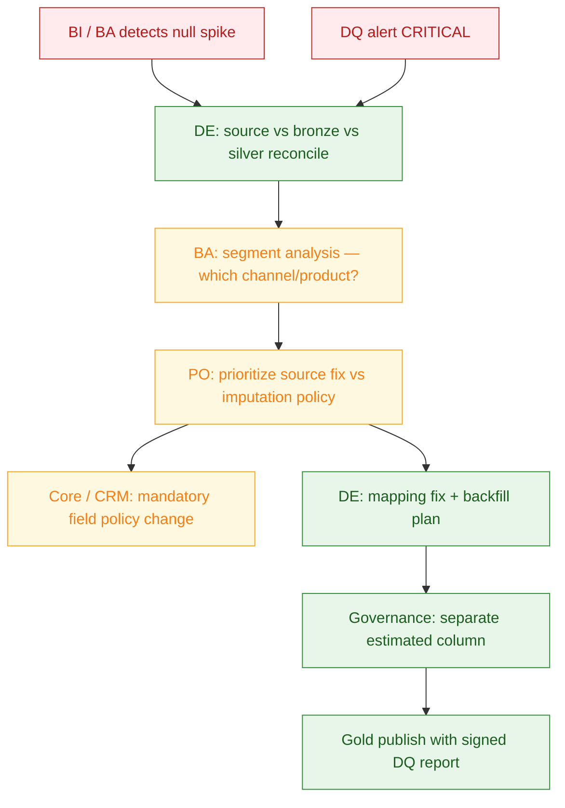

# Vendor ↔ Bank collaboration — BA, PO, internal IT

> How consulting delivery (BCG + SI) works with **MSB / TCB-style** bank teams during Digital Bank Transform data programs.

---

## 1. RACI (customer domain ETL)

| Activity | BCG / Vendor DELETED | Bank PO | Bank BA | Bank IT / DE | Core squad | Risk / Compliance |
|----------|---------------------|---------|---------|--------------|------------|-------------------|
| Target architecture | **R** | A | C | C | I | C |
| Source inventory | C | I | **R** | C | **R** | I |
| Mapping spec | **R** | A | **R** | C | C | C |
| Glue / Spark jobs | **R** | I | I | **A** (prod ops) | I | I |
| DQ rules definition | C | A | **R** | **R** | I | **A** (credit rules) |
| Gold publish go/no-go | C | **A** | C | **R** | I | C |
| Incident P1 response | **R** (build fix) | I | I | **R** (runbook) | C | I |
| Hypercare → BAU handover | C | **A** | I | **R** | I | I |

*R = Responsible, A = Accountable, C = Consulted, I = Informed*

---

## 2. Weekly ceremony (typical hybrid program)

| Meeting | Attendees | Output |
|---------|-----------|--------|
| **SteerCo** (biweekly) | CDO, PO, consulting lead | Scope / risk decisions |
| **Sprint planning** | PO, vendor scrum, bank DE | Jira backlog, mapping tickets |
| **Data triage** | BA, vendor DE, bank DE | Open DQ issues, source gaps |
| **Core sync** | Core squad, DBA, extract owner | Extract window, T24 COB calendar |
| **UAT sign-off** | BA, PO, BI lead | Pass/fail on staging partition |

---

## 3. When source input is missing

**Scenario:** Core squad delays CRM view for income field — gold mart blocked.

| Step | Who | Action |
|------|-----|--------|
| 1 | BA | Document business impact (# campaigns blocked, which KPI) |
| 2 | PO | Escalate on RAID log; negotiate MVP without CRM or synthetic interim |
| 3 | Vendor DE | Implement partial silver with `source_system='CORE_ONLY'` flag |
| 4 | Bank IT | Secure read-only DB grant or API; track in change ticket |
| 5 | Compliance | Confirm interim mart not used for credit decisions |

**Anti-pattern:** Vendor builds assumed mapping without BA sign-off → production metric drift.

---

## 4. Missing customer fields — process playbook



Detail case: [`06-case-missing-customer-income.md`](06-case-missing-customer-income.md)

**Consulting DE communication scripts** (proactive BA/PO updates): [`../prep/interview/README.md`](../prep/interview/README.md)

---

## 5. Data governance issues — who decides what

| Question | Decision maker | Engineering implements |
|----------|----------------|------------------------|
| Can we use estimated income in marketing? | Marketing + compliance | Flag in Athena view |
| Can estimated income appear in credit scorecard? | **Model risk — usually NO** | Block via Lake Formation + mart role |
| PII in dev environment? | CISO / data owner | Masked subset only; LF deny tags |
| Retention 7 years bronze? | Legal / NHNN guidance | S3 lifecycle policy |
| Vendor access to prod Oracle? | Bank IT | Jump host + read-only + time-boxed |

---

## 6. Communication templates

### 6.1 BA → Vendor (mapping clarification)

```text
Subject: [DATA-1234] CRM income field — source of truth confirmation

For gold.dim_customer.declared_income_amount:
- Confirm SoR: CRM party_income vs core retail_customer?
- If CRM wins when last_update_ts newer, please update mapping spec to v2.3.
- UAT sample: 50 CIFs attached — expected declared income in column X.
Target staging partition: dt=2025-05-21
```

### 6.2 Vendor → Bank IT (extract failure)

```text
Subject: P2 — Oracle extract incomplete 2025-05-21

Impact: silver customer partition 80% loaded; gold publish blocked by DQ.
Root cause: VPN blip during unload 02:15 VN; _SUCCESS marker not written.
Action: Re-run extract chunk 3/5 after DBA confirms window open.
ETA: 04:30 VN. BI notified — do not refresh Tableau customer mart.
```

---

## 7. Handover criteria (consulting exit)

| Criterion | Evidence |
|-----------|----------|
| Bank DE runs pipelines 2 weeks solo | Shadow → reverse shadow log |
| Runbooks for top 5 incidents | Confluence + PagerDuty links |
| Mapping specs in bank Git | Not vendor-only repo |
| DQ dashboard owned by bank | QuickSight / Athena saved queries |
| PO sign-off on SSOT MVP scope | SteerCo minutes |
