# Source → Target Data Mapping — Customer Domain

> **Program:** Digital Bank Transform — Data Enhancement (BCG-led, MSB / TCB pattern)  
> **Purpose:** Single reference for BA, PO, vendor DE, and bank IT when reconciling ETL incidents.

---

## 1. Mapping principles

| Rule | Rationale |
|------|-----------|
| One **golden** `customer_id` in gold | SSOT for all downstream BI |
| Keep **source keys** in `xref_customer_id` | Traceability to T24 / CRM / app |
| Never map NULL income → 0 | Preserves true missingness for DQ |
| Separate `declared_*` vs `estimated_*` | Governance for credit vs marketing |
| All rows carry `pipeline_run_id` | Lineage for audit |

---

## 2. Customer entity — source to target

| Source system | Source table / field | Bronze column | Silver column | Gold column | Transform rule | Owner |
|---------------|---------------------|---------------|---------------|-------------|----------------|-------|
| T24 Oracle | `FBNK_CUSTOMER.CUSTOMER_NO` | `customer_no` | `t24_customer_no` | `xref` only | Store in crosswalk | Core squad |
| Oracle Core | `core.retail_customer.customer_id` | `customer_id` | `customer_id` | `customer_id` (NK) | Primary golden key | Bank DE |
| Oracle Core | `declared_income_amount` | `declared_income_amount` | same | `declared_income_amount` | Pass-through; NULL allowed | Bank DE |
| Oracle CRM | `crm.party_income.annual_income` | `party_income` | `crm_income_amount` | Merge to declared if newer | **Coalesce by `last_update_ts`** | Vendor + BA |
| Mobile app | `onboarding.income_range_code` | `income_range_code` | `income_range_midpoint` | `declared_income_amount` | Map range → midpoint **only if policy approved** | Product + BA |
| Bureau (optional) | external API | `bureau_income` | `estimated_income_amount` | `estimated_income_amount` | Never overwrite declared | Risk + compliance |

---

## 3. T24 account domain

| Source | Target silver | Target gold | Notes |
|--------|---------------|-------------|-------|
| `FBNK_ACCOUNT.ACCOUNT_NO` | `account_no` | `fact_account.account_no` | NK |
| `FBNK_ACCOUNT.CUSTOMER_NO` | `t24_customer_no` | Join via `xref_customer_id` | **Common break:** unmapped CIF |
| `WORKING_BALANCE` | `balance` | `fact_account.balance` | Scale `DECIMAL(18,2)` |
| `CURRENCY` | `currency` | `currency` | ISO 4217 validate |

---

## 4. Common mapping failures (production)

| Symptom | Likely mapping gap | Fix process |
|---------|-------------------|-------------|
| CRM income in app but NULL in gold | CRM not in silver join | BA confirms SoR → DE adds source → regression test |
| Duplicate customers | `party_id` used as golden key | PO prioritizes xref backlog; survivorship workshop |
| T24 `CUSTOMER_NO` ≠ core `CIF` | Crosswalk incomplete | Core squad provides mapping file; bronze quarantine until loaded |
| Income shows 0 not NULL | Legacy `NVL(x,0)` in old ODS | Replace with explicit NULL; backfill one partition |
| Mobile range code wrong band | BA spec outdated | Update mapping CSV in Git; Glue job reads versioned config |

---

## 5. Change control (vendor ↔ bank)

```mermaid
flowchart LR
    classDef ba fill:#fff3e0,stroke:#ef6c00,color:#e65100
    classDef po fill:#fce4ec,stroke:#c2185b,color:#880e4f
    classDef de fill:#e8f5e9,stroke:#2e7d32,color:#1b5e20
    classDef bank fill:#e3f2fd,stroke:#1565c0,color:#0d47a1

    REQ["BA: field change request"]:::ba
    PO["PO: prioritize sprint"]:::po
    SPEC["Mapping spec vX.Y in Confluence/Git"]:::ba
    DEV["Vendor DE: implement + unit test"]:::de
    UAT["Bank DE + BA: UAT on staging"]:::bank
    SIGN["PO + Data Owner sign-off"]:::po
    PROD["Deploy via CodePipeline"]:::de

    REQ --> PO --> SPEC --> DEV --> UAT --> SIGN --> PROD
```

---

## 6. Sign-off checklist (before gold publish)

- [ ] Mapping spec version matches deployed Glue job parameter
- [ ] Sample reconcile: 1,000 keys source vs silver hash match
- [ ] DQ contract: no CRITICAL failures on partition
- [ ] BA confirms metric definition unchanged or communicated to BI
- [ ] PO accepts known WARNING items with ticket ID
