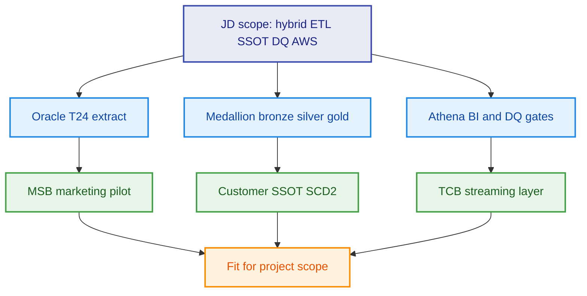
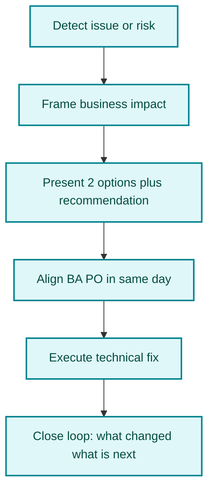
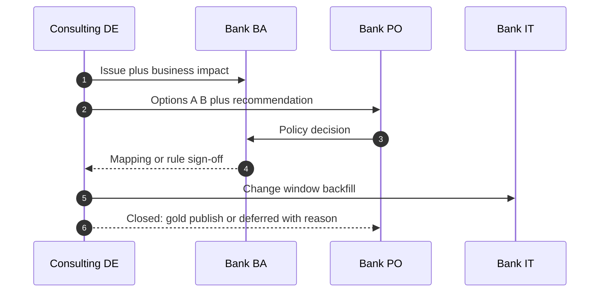

# Consulting DE — Technical fit & client communication (talking points)

> Prep for **consulting-led** data programs (BCG-style SI, bank PO/BA/CDO). Use this to address feedback: strong technical fit, need more **proactive, independent, consulting-level** client relationship.

---

## 1. Positioning summary (what client needs to hear)

| Dimension | Message to client | Evidence in this repo |
|-----------|-------------------|------------------------|
| **Technical** | Anh Tú có nền tảng kỹ thuật vững, kinh nghiệm phù hợp scope hybrid Oracle/T24 → AWS, SSOT, DQ, streaming | `samples/`, `docs/03-to-be-architecture.md`, MSB/TCB cases |
| **Consulting delivery** | Không chỉ “làm ticket ETL” — chủ động dẫn dắt vấn đề, giao tiếp rõ với BA/PO, đảm bảo satisfaction suốt dự án | `docs/07-vendor-bank-collaboration.md`, incident playbooks |
| **Growth area (honest)** | Đã nhận feedback communication; cam kết tăng chủ động, nhạy bén, độc lập hơn trong client relationship | Section 3–5 below |

---

## 2. Technical — what to say (VN + EN)

### 2.1 One-liner (Vietnamese)

> Về mặt kỹ thuật, em có kinh nghiệm trực tiếp trên các program banking consulting: hybrid ingest Oracle/T24 lên AWS, customer SSOT, DQ shift-left, và streaming cho digital parallel run. Scope trong JD — Glue/Spark, Redshift/Athena, governance — trùng với những gì em đã làm ở MSB và TCB-style engagement.

### 2.2 One-liner (English)

> On the technical side, I have hands-on experience on consulting-led banking programs: hybrid Oracle and T24 ingestion to AWS, customer SSOT, shift-left data quality, and streaming for digital parallel run. The scope maps directly to Glue and Spark ETL, Redshift and Athena serving, and governed medallion patterns documented in this portfolio.

### 2.3 Proof points (cite live in interview)

| Topic | Say this | Point to |
|-------|----------|----------|
| Hybrid extract | Watermarked Oracle extract + T24 FBNK pattern, respect COB window | `samples/oracle_extract_customer.sql`, `t24_account_extract.sql` |
| Quality | No silent `NVL(NULL,0)` — quarantine + declared vs estimated | `glue_customer_bronze_to_silver.py`, `dim_customer_scd2.sql` |
| Governance | CRITICAL blocks gold; WARNING allows with flag | `dq_contract.py`, `dq_income_completeness.sql` |
| Scale constraint | Prod core cannot leave bank → synthetic + Kafka path | `cases/tcb-digital-streaming-layer.md` |
| Pilot before big-bang | Marketing domain on AWS first | `cases/msb-marketing-aws-pilot.md` |

### 2.3 Technical credibility diagram

---

## 3. Communication & client relationship — what to say

### 3.1 Acknowledge feedback (Vietnamese — honest, không phòng thủ)

> Em hiểu feedback của anh/chị: với khách hàng consulting, mức deliver không chỉ là code chạy đúng mà còn là **chủ động quản lý kỳ vọng, làm rõ trade-off, và giữ nhịp giao tiếp** với BA/PO suốt sprint. Em đã có nền kỹ thuật tốt; phần em đang cố tình nâng thêm là **độ chủ động và độc lập** khi xử lý relationship — không chờ được hỏi mới báo cáo, mà chủ động đưa options và next step.

### 3.2 Commitment (English)

> I take the communication feedback seriously. On consulting programs, delivery is not only correct pipelines — it is **trusted partnership**: proactive status, clear options, and early escalation before surprises hit the steering committee. I am intentionally operating one level up — as a consulting DE who owns the narrative with BA and PO, not only task execution.

### 3.3 Consulting vs pure delivery DE

| Pure delivery DE | Consulting-level DE (target) |
|----------------|------------------------------|
| Waits for ticket / mapping PDF | Co-drafts mapping with BA; flags gaps in refinement |
| Reports “job failed” | Reports impact, root cause, 2 options, recommendation, ETA |
| Silent until demo | Weekly concise RAID + dependency callouts |
| Fixes data in silo | Brings PO into go/no-go when DQ CRITICAL |
| Speaks only tech jargon | Translates to business impact (# campaigns, audit risk) |

---

## 4. Proactive behaviors — scripts you can say on the call

### 4.1 Daily / sprint rhythm

**Vietnamese (stand-up với PO/BA):**

> Hôm nay em có 3 điểm cần sync: (1) partition T24 extract có risk trễ COB — em đề xuất chạy incremental thay full; (2) income field vẫn 70% null ở mobile — em cần PO quyết imputation có được dùng cho marketing không; (3) gold publish dự kiến thứ Sáu nếu DQ PASS. Anh/chị confirm priority giúp em.

**English:**

> Three items for today: T24 extract window risk — I recommend incremental instead of full; mobile income still seventy percent null — I need PO decision on whether estimated income is allowed for marketing; gold publish Friday pending DQ pass. Please confirm priority.

### 4.2 When source is missing (don't wait)

**Vietnamese:**

> Em phát hiện CRM view chưa có trường income — nếu không có trong 48h thì mart marketing bị block. Em đề xuất Plan A: publish silver CORE_ONLY có flag `source_system`; Plan B: PO escalate core squad. Em recommend Plan A cho MVP tuần này, Plan B song song. Em cần quyết trong hôm nay để không trễ sprint goal.

### 4.3 When DQ fails in prod

**Vietnamese:**

> DQ CRITICAL trên silver income — em đã reconcile: 45% do optional UI, 20% do mapping thiếu CRM. Em không publish gold cho đến khi BA sign-off segment analysis. ETA fix mapping + backfill: 2 ngày làm việc. Em sẽ gửi one-pager cho PO trước 5pm.

### 4.4 Steering / exec update (consulting tone)

**English (30 seconds):**

> This week we stayed green on pipeline SLA. One amber: CRM income dependency — business impact is two campaign segments on hold. We proposed interim silver with explicit flags; compliance confirmed not for credit use. Decision needed from PO by Wednesday to protect Friday gold publish.

---

## 5. Communication flow (consulting DE owns the thread)

---

## 6. 30-day action plan (show you are closing the gap)

| Week | Focus | Visible to client |
|------|-------|-------------------|
| 1 | Map stakeholders; confirm RACI with PO | Stakeholder map sent; no “who owns this?” delays |
| 2 | Daily 3-bullet status to PO/BA | Proactive, not reactive |
| 3 | Lead one data triage; document RAID | You facilitate, not only attend |
| 4 | Own one exec readout (1 slide: green/amber/red) | Consulting-level visibility |

**Vietnamese (closing sentence for interview):**

> Trong 30 ngày đầu, em sẽ chủ động own communication rhythm với PO/BA: status ngắn hàng ngày, escalation sớm khi có risk, và mỗi issue đều kèm business impact + phương án — để đảm bảo satisfaction và không để stakeholder phải “đoán” tiến độ.

---

## 7. Combined pitch (60 seconds — VN)

> Em là Data Engineer consulting banking, mạnh hybrid Oracle/T24 lên AWS, customer SSOT và DQ. Kỹ thuật em phù hợp scope dự án như portfolio MSB/TCB trong repo này. Song song, em hiểu khách consulting cần delivery ở mức tư vấn: em cam kết chủ động hơn trong relationship — báo cáo sớm, đưa lựa chọn rõ, align BA/PO trong ngày, và close loop đến khi PO hài lòng với kết quả, không chỉ khi job chạy xong.

---

## 8. Combined pitch (60 seconds — EN)

> I am a consulting data engineer focused on Vietnamese retail banking and AWS hybrid migration. Technically I fit the scope — SSOT, medallion ETL, DQ gates, and streaming under regulatory constraints, as shown in the MSB and TCB patterns in this repo. I also understand that on consulting programs, communication is part of delivery. I am deliberately operating with more proactivity: early risk surfacing, business-framed updates, clear options for PO decisions, and same-day alignment with BA — so stakeholders stay informed and satisfied throughout the engagement, not only at go-live.

---

## Related docs

- [**1-page cheat sheet (print)**](06-consulting-de-cheat-sheet-1page.md) — pitch, scripts, proof points on one page  
- [`../docs/07-vendor-bank-collaboration.md`](../docs/07-vendor-bank-collaboration.md) — RACI, ceremonies  
- [`../docs/06-case-missing-customer-income.md`](../docs/06-case-missing-customer-income.md) — flagship consulting story  
- [`01-cto-round-prep.md`](01-cto-round-prep.md) — technical deep dive  
- [`03-jd-kup-partner-mapping.md`](03-jd-kup-partner-mapping.md) — JD evidence map  
