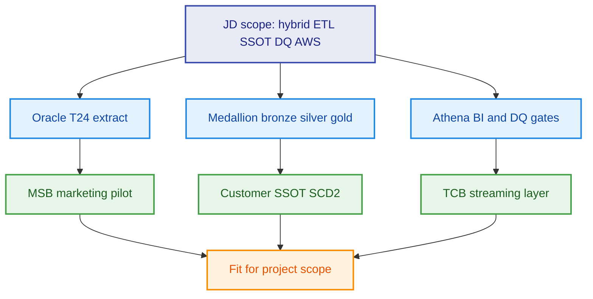
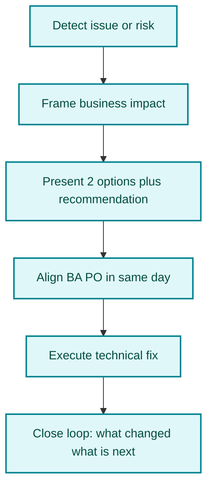
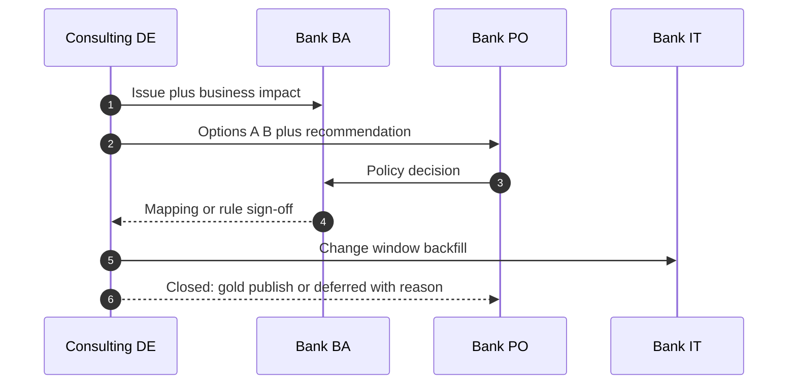

# Consulting DE — Technical fit & client communication (talking points)

> Prep for **consulting-led** data programs (BCG-style SI, bank PO/BA/CDO). Addresses feedback: strong technical fit; need more **proactive, independent, consulting-level** client relationship.

---

## 1. Positioning summary (what client needs to hear)

| Dimension | Message to client | Evidence in this repo |
|-----------|-------------------|------------------------|
| **Technical** | Strong hands-on fit for hybrid Oracle/T24 → AWS, SSOT, DQ, streaming | `samples/`, `docs/03-to-be-architecture.md`, MSB/TCB cases |
| **Consulting delivery** | Not only ETL tickets — lead issues, communicate clearly with BA/PO, sustain satisfaction | `docs/07-vendor-bank-collaboration.md`, incident playbooks |
| **Growth area (honest)** | Communication feedback acknowledged; committed to more proactive, agile, independent client handling | Sections 3–6 below |

---

## 2. Technical — what to say

### 2.1 One-liner

> On the technical side, I have hands-on experience on consulting-led banking programs: hybrid Oracle and T24 ingestion to AWS, customer SSOT, shift-left data quality, and streaming for digital parallel run. The scope maps directly to Glue and Spark ETL, Redshift and Athena serving, and governed medallion patterns documented in this portfolio.

### 2.2 Proof points (cite live in interview)

| Topic | Say this | Point to |
|-------|----------|----------|
| Hybrid extract | Watermarked Oracle extract + T24 FBNK pattern, respect COB window | `samples/oracle_extract_customer.sql`, `t24_account_extract.sql` |
| Quality | No silent `NVL(NULL,0)` — quarantine + declared vs estimated | `glue_customer_bronze_to_silver.py`, `dim_customer_scd2.sql` |
| Governance | CRITICAL blocks gold; WARNING allows with flag | `dq_contract.py`, `dq_income_completeness.sql` |
| Scale constraint | Prod core cannot leave bank → synthetic + Kafka path | `cases/tcb-digital-streaming-layer.md` |
| Pilot before big-bang | Marketing domain on AWS first | `cases/msb-marketing-aws-pilot.md` |

### 2.3 Technical credibility diagram

---

## 3. Communication & client relationship — what to say

### 3.1 Acknowledge feedback (honest, non-defensive)

> I understand the feedback: on consulting engagements, delivery is not only correct code — it is **proactive expectation management, clear trade-offs, and steady communication** with BA and PO every sprint. My technical foundation is strong; I am deliberately raising **proactivity and independence** in client relationships — not waiting to be asked before reporting status, options, and next steps.

### 3.2 Commitment

> I take the communication feedback seriously. On consulting programs, delivery is **trusted partnership**: proactive status, clear options, and early escalation before surprises reach steering. I operate as a consulting DE who owns the narrative with BA and PO, not only task execution.

### 3.3 Consulting vs pure delivery DE

| Pure delivery DE | Consulting-level DE (target) |
|------------------|------------------------------|
| Waits for ticket / mapping PDF | Co-drafts mapping with BA; flags gaps in refinement |
| Reports “job failed” | Reports impact, root cause, 2 options, recommendation, ETA |
| Silent until demo | Weekly concise RAID + dependency callouts |
| Fixes data in silo | Brings PO into go/no-go when DQ CRITICAL |
| Speaks only tech jargon | Translates to business impact (# campaigns, audit risk) |

---

## 4. Proactive behaviors — scripts for the call

### 4.1 Daily / sprint rhythm

> Three items for today: T24 extract window risk — I recommend incremental instead of full; mobile income still seventy percent null — I need PO decision on whether estimated income is allowed for marketing; gold publish Friday pending DQ pass. Please confirm priority.

### 4.2 When source is missing (do not wait)

> CRM view is missing the income field — if not available within forty-eight hours, the marketing mart is blocked. Plan A: publish silver CORE_ONLY with a `source_system` flag. Plan B: PO escalates the core squad. I recommend Plan A for this week’s MVP and Plan B in parallel. I need a decision today to protect the sprint goal.

### 4.3 When DQ fails in production

> DQ CRITICAL on silver income — I reconciled: forty-five percent optional UI, twenty percent CRM not in ETL. I will not publish gold until BA signs off the segment analysis. ETA for mapping fix and backfill: two business days. I will send a one-pager to PO before 5pm.

### 4.4 Steering / exec update (30 seconds)

> This week we stayed green on pipeline SLA. One amber: CRM income dependency — business impact is two campaign segments on hold. We proposed interim silver with explicit flags; compliance confirmed not for credit use. Decision needed from PO by Wednesday to protect Friday gold publish.

---

## 5. Communication flow (consulting DE owns the thread)

---

## 6. 30-day action plan (closing the gap)

| Week | Focus | Visible to client |
|------|-------|-------------------|
| 1 | Map stakeholders; confirm RACI with PO | Stakeholder map sent; no “who owns this?” delays |
| 2 | Daily 3-bullet status to PO/BA | Proactive, not reactive |
| 3 | Lead one data triage; document RAID | You facilitate, not only attend |
| 4 | Own one exec readout (1 slide: green/amber/red) | Consulting-level visibility |

**Closing sentence for interview:**

> In the first thirty days I will own the communication rhythm with PO and BA: short daily status, early escalation with business impact and options, and closed loops — so stakeholders never have to guess progress.

---

## 7. Combined pitch (60 seconds)

> I am a consulting data engineer focused on Vietnamese retail banking and AWS hybrid migration. Technically I fit the scope — SSOT, medallion ETL, DQ gates, and streaming under regulatory constraints, as shown in the MSB and TCB patterns in this repo. On consulting programs, communication is part of delivery. I am deliberately operating with more proactivity: early risk surfacing, business-framed updates, clear options for PO decisions, and same-day alignment with BA — so stakeholders stay informed and satisfied throughout the engagement, not only at go-live.

---

## Related docs

- [**1-page cheat sheet (print)**](06-consulting-de-cheat-sheet-1page.md)  
- [`../../docs/07-vendor-bank-collaboration.md`](../../docs/07-vendor-bank-collaboration.md) — RACI, ceremonies  
- [`../../docs/06-case-missing-customer-income.md`](../../docs/06-case-missing-customer-income.md) — flagship consulting story  
- [`01-cto-round-prep.md`](01-cto-round-prep.md) — technical deep dive  
- [`03-jd-kup-partner-mapping.md`](03-jd-kup-partner-mapping.md) — JD evidence map  
