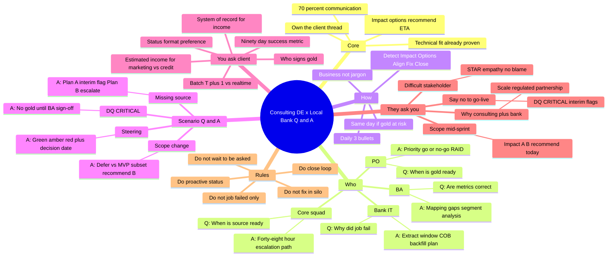
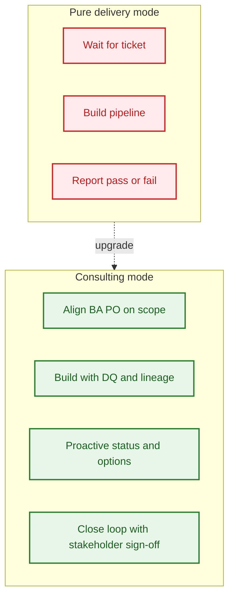
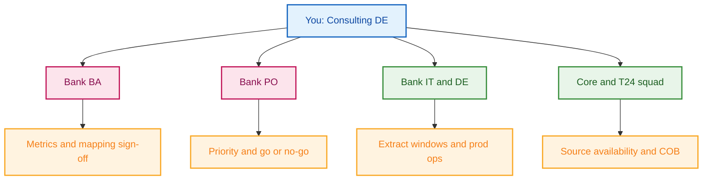
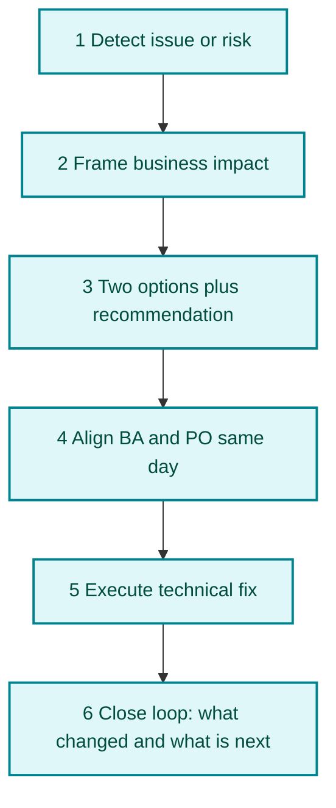
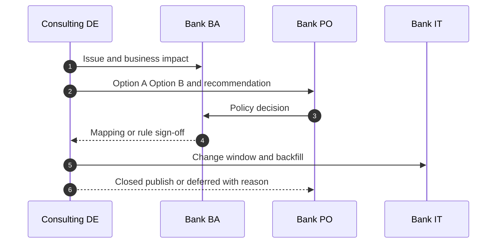
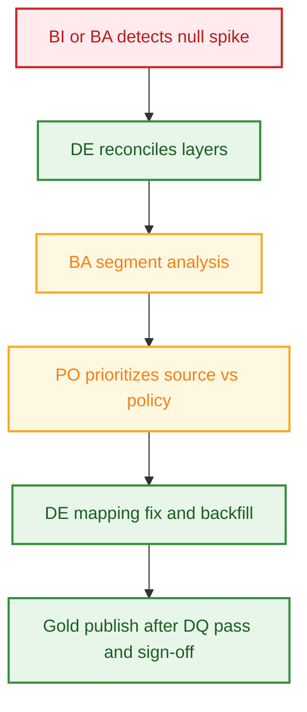
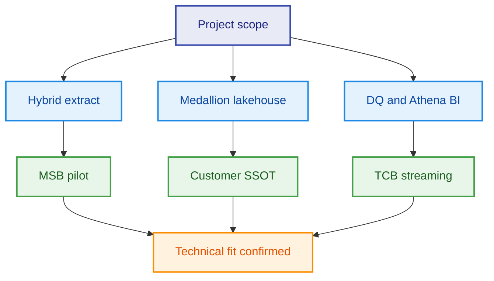
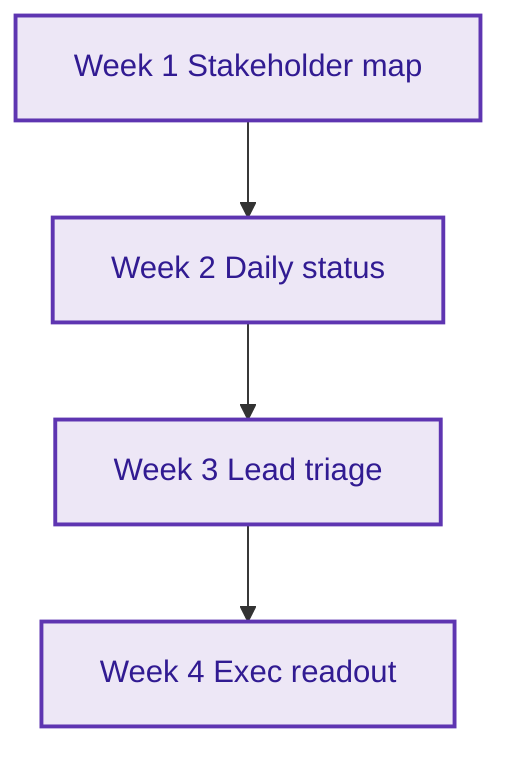

# Consulting client round — DE communication prep

> **Single prep guide** for the post-technical round. Focus: **client relationship, proactive consulting delivery**, and business-framed communication on BCG-style bank programs.  
> Case study repo: [`../../README.md`](../../README.md) · Collaboration playbook: [`../../docs/07-vendor-bank-collaboration.md`](../../docs/07-vendor-bank-collaboration.md)

---

## 0. Round strategy

| Round | Your goal | Time on topic |
|-------|-----------|---------------|
| Technical (done) | Prove hybrid ETL, SSOT, DQ, AWS patterns | Mostly engineering |
| **This round** | Prove **consulting-level partnership** with BA, PO, IT | 70% communication · 30% technical recap |

**Core message:** Technical fit is already demonstrated. This round shows you **own the client thread** — proactive status, clear trade-offs, early escalation, closed loops.

---

## 0.1 Quick learn (10 min) — Q&A mindmap: communicate with local bank as consulting DE

**How to use this mindmap (≈10 minutes)**

| Min | Focus | Jump to |
|-----|--------|---------|
| 1–2 | Core message + who you talk to | Center → **Core** + **Who** |
| 3–4 | Six-step loop + daily stand-up pattern | **How** → §5, §6.1 |
| 5–6 | Three hot scenarios (missing source, DQ, scope) | **Scenario Q&A** → §6.2–6.5 |
| 7–8 | Questions you ask + they ask you | **You ask** / **They ask** → §9–10 |
| 9–10 | Do / don't + closing commitment | **Rules** → §12, §11 |

**Scenario quick answers (say this structure)**

| They say / situation | Your answer shape |
|----------------------|-------------------|
| “When will income be fixed?” | Impact → root cause % → two options → recommend → ETA → decision needed today |
| “Can we go live?” | DQ status → gold blocked or interim with flags → who must sign off |
| “Scope changed” | Blast radius → Option A defer → Option B MVP → recommend + PO sign-off today |
| “Give me a status” | Green / amber / red → one risk → one PO decision → gold ETA |

---

## 1. Opening pitch (60 seconds)

> I am a consulting data engineer on Vietnamese retail banking programs — hybrid Oracle and T24 to AWS, customer SSOT, and shift-left data quality. The technical scope matches what I have delivered on MSB and TCB-style engagements in this portfolio.  
>  
> On consulting programs, communication is part of delivery. I deliberately operate with more proactivity: I surface risks early, frame issues in business impact, present options with a recommendation, align BA and PO the same day, and close the loop so stakeholders are never guessing progress.

---

## 2. Acknowledge feedback (honest, non-defensive)

> I understand the feedback: on consulting engagements, delivery is not only correct pipelines — it is **proactive expectation management, clear trade-offs, and steady communication** with BA and PO every sprint. My technical foundation is strong; I am intentionally raising **proactivity and independence** in client relationships.

---

## 3. Consulting vs pure delivery DE

| Pure delivery DE | Consulting-level DE (your target) |
|------------------|-----------------------------------|
| Waits for ticket or mapping PDF | Co-drafts mapping with BA; flags gaps in refinement |
| Reports job failed | Reports impact, root cause, two options, recommendation, ETA |
| Silent until demo | Daily 3-bullet status plus weekly RAID callouts |
| Fixes data in silo | Brings PO into go or no-go when DQ is CRITICAL |
| Tech jargon only | Translates to campaigns blocked, audit risk, SLA breach |

---

## 4. Stakeholder map (who you communicate with)

---

## 5. Communication playbook (own the thread)

### 5.1 Six-step loop

### 5.2 Sequence (typical escalation)

---

## 6. Ready scripts (say on the call)

### 6.1 Daily stand-up (3 bullets)

> Three items today: one — T24 extract window risk, I recommend incremental not full. Two — mobile income still seventy percent null, I need PO decision on estimated income for marketing. Three — gold publish Friday if DQ passes. Please confirm priority.

### 6.2 Missing source (do not wait)

> CRM view is missing the income field. If not available in forty-eight hours the marketing mart is blocked. Plan A: silver CORE_ONLY with source_system flag. Plan B: PO escalates core squad. I recommend Plan A for this sprint MVP and Plan B in parallel. I need a decision today.

### 6.3 DQ CRITICAL in production

> DQ CRITICAL on silver income. I reconciled root cause: forty-five percent optional UI, twenty percent CRM not in ETL. I will not publish gold until BA signs off segment analysis. Fix and backfill ETA two business days. One-pager to PO before 5pm.

### 6.4 Steering update (30 seconds)

> We are green on pipeline SLA. One amber item: CRM income dependency — two campaign segments on hold. Interim silver with explicit flags; compliance confirmed not for credit use. PO decision needed by Wednesday to protect Friday gold publish.

### 6.5 Scope change mid-sprint

> The new mapping affects gold grain and DQ rules. Impact: two dashboards and one API contract. Option A: defer to next sprint with documented RAID. Option B: MVP subset this sprint with flagged columns. I recommend Option B with PO sign-off today so we protect the release date.

---

## 7. Flagship story — missing income (consulting angle)

Use this as your **STAR** when they ask how you handle client issues.

| Step | What to say |
|------|-------------|
| **Situation** | Marketing mart blocked; seventy percent null income on mobile onboarding |
| **Task** | Restore trust with BA and PO while fixing data, not only the pipeline |
| **Action** | Reconciled bronze vs silver vs source; segment analysis with BA; presented imputation policy options; separate declared vs estimated columns; blocked gold on CRITICAL DQ |
| **Result** | PO signed interim approach; campaigns unblocked with flags; audit-safe separation for credit |

**Business one-liner:** *Measure, segment, fix source, gate gold, flag estimates — never silent NVL in legacy ETL.*

Detail: [`../../docs/06-case-missing-customer-income.md`](../../docs/06-case-missing-customer-income.md)

---

## 8. Technical recap (keep short — 30 seconds)

| Topic | One line | Repo proof |
|-------|----------|------------|
| Hybrid extract | Watermarked Oracle and T24, respect COB | `samples/oracle_extract_customer.sql` |
| Quality | No silent NULL to zero; quarantine invalid | `samples/glue_customer_bronze_to_silver.py` |
| SSOT | Declared vs estimated income in SCD2 | `samples/dim_customer_scd2.sql` |
| Governance | CRITICAL blocks gold | `samples/dq_contract.py` |
| Streaming | Synthetic core plus Kafka when prod cannot export | `cases/tcb-digital-streaming-layer.md` |
| Pilot | Marketing domain on AWS first | `cases/msb-marketing-aws-pilot.md` |

---

## 9. Questions to ask the client (shows consulting mindset)

1. Who signs gold go or no-go — PO, Compliance, or both?  
2. Can estimated income be used for marketing vs credit decisions?  
3. System of record for income — core, CRM, or onboarding app?  
4. Batch T+1 or near-real-time for customer attributes?  
5. What is the ninety-day success metric for this program?  
6. How do you prefer status — daily bullets, RAID log, or steering slide?  

---

## 10. Behavioral prompts (communication-focused)

| Question | Angle to answer |
|----------|-----------------|
| Tell me about a difficult stakeholder | Show empathy, structured updates, no blame |
| When did you say no to go-live? | DQ CRITICAL, PO aligned, offered interim with flags |
| Scope change mid-sprint | Impact, options, recommendation, same-day PO decision |
| Mentor junior on client calls | Teach business framing, not only SQL |
| Why consulting plus bank? | Impact at scale, regulated domain, partnership with BA |

---

## 11. Thirty-day commitment

| Week | You will demonstrate |
|------|----------------------|
| 1 | Stakeholder map and RACI confirmed with PO |
| 2 | Daily proactive 3-bullet status to BA and PO |
| 3 | You lead one data triage and RAID item |
| 4 | One exec slide: green, amber, red |

**Closing line:**

> In the first thirty days I will own communication rhythm with PO and BA: short daily status, early escalation with business impact and options, and closed loops until stakeholders are satisfied.

---

## 12. One-page cheat sheet (print this section)

| Do | Do not |
|----|--------|
| Daily 3-bullet status | Wait to be asked |
| Impact plus A/B plus recommend plus ETA | Job failed only |
| Escalate same day if gold at risk | Fix in silo |
| Close loop after fix | Go quiet until demo |

**Incident mnemonic:** `Detect` → `Impact` → `Options` → `Align` → `Fix` → `Close`

**Stand-up template:** Risk ___ · PO decision ___ · Gold ETA ___

---

## 13. JD alignment (quick reference)

| JD theme | Repo evidence |
|----------|---------------|
| Hybrid Oracle and AWS ETL | `samples/oracle_extract_customer.sql`, `airflow_hybrid_etl_dag.py` |
| Lakehouse and Redshift | `docs/03-to-be-architecture.md`, `dim_customer_scd2.sql` |
| SSOT and DQ | `docs/06-case-missing-customer-income.md`, `dq_contract.py` |
| Partner BA and PO | `docs/07-vendor-bank-collaboration.md`, this guide |

---

## 14. Related materials

| Resource | Link |
|----------|------|
| Main case study README | [`../../README.md`](../../README.md) |
| Vendor and bank RACI | [`../../docs/07-vendor-bank-collaboration.md`](../../docs/07-vendor-bank-collaboration.md) |
| Missing income deep dive | [`../../docs/06-case-missing-customer-income.md`](../../docs/06-case-missing-customer-income.md) |
| Mock technical transcript (HTML) | [`04-mock-technical-interview-30min-transcript.html`](04-mock-technical-interview-30min-transcript.html) |

---

*Last updated: consulting client round prep — English only · GitHub-safe Mermaid (top-down, quoted labels)*
